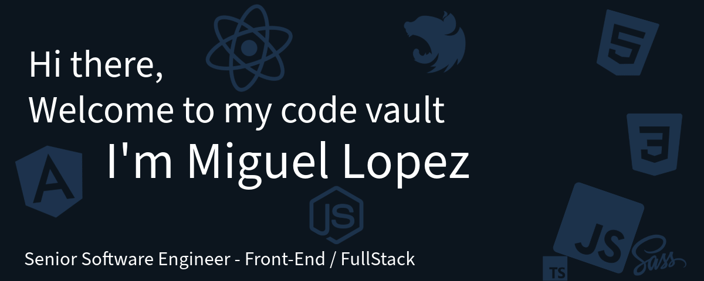

<!-- # Hi there welcome to my code vault, I'm Miguel 👋
Senior Software Engineer - Front-End / FullStack -->

<!-- Banner here -->
## About Me
I have been programming since 2013 and turned professional in 2018. I began my career as a front-end developer and
recently transitioned to a full-stack role. My passion lies in leveraging technology to improve people's lives.
Recently, I discovered the transformative potential of AI, and I am now an avid advocate for its use in opening new
possibilities.

- 🔭 I’m currently working on an app to connect professional services
- 🌱 I’m currently learning about Prompt Engineering for Developers
- 🖼️ I am a photography lover
- 🏔️ I love being in nature
- ⚡ Interesting fact: I traveled throughout South America by car from north to south

## Main TechStack:
<table>
<thead>
<tr>
<th>Coding</th>
<th>Tools</th>
</tr>
</thead>
<td>

| Technology                                                                                                           | Knowledge level | Years |
|----------------------------------------------------------------------------------------------------------------------|:---------------:|:-----:|
|  HTML5             |    Advanced     |   8   |
|  CSS3 / SASS       |    Advanced     |   8   |
|  Javascript       |    Advanced     |   8   |
|  Typescript |    Advanced     |   6   |
|  Angular                                                |    Advanced     |   6   |
|  NodeJs     |  Intermediate   |   4   |
|  React      |  Intermediate   |   1   |
|  NextJS     |  Intermediate   |   1   |
</td>
<td>

| Tool                                                                                                              | Knowledge level | Years |
|-------------------------------------------------------------------------------------------------------------------|:---------------:|:-----:|
|  Github         |     Advance     |  10   |
|  Linux          |  Intermediate   |   5   |
|  Redux   |     Advance     |   4   |
|  Jira    |  Intermediate   |   4   |
|  Jenkins        |      Basic      |   4   |
|  Open AI |  Intermediate   |   1   |
|  PostgreSQL     |      Basic      |   1   |
|  Vercel  |      Basic      |   1   |

</td>
</table>

### Other technologies

## My roles in the industry
| Role                      | Year        |
|---------------------------|-------------|
| Front-End Team Lead       | 2021 - 2023 |
| Senior Software Developer | 2020 - 2021 |
| Software Developer        | 2018 - 2020 |
| Junior Software developer | 2017 - 2018 |

## Git Stats

### References
Icons from  <a target="_blank" href="https://icons8.com">Icons8</a>

Stats from <a href="https://github.com/denvercoder1/github-readme-streak-stats">GitHub streak stats</a>
